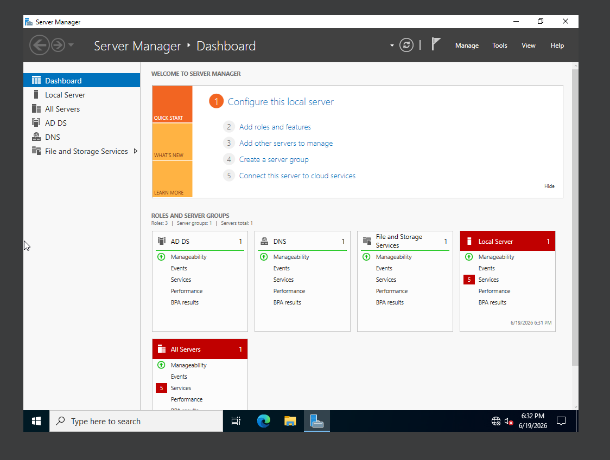
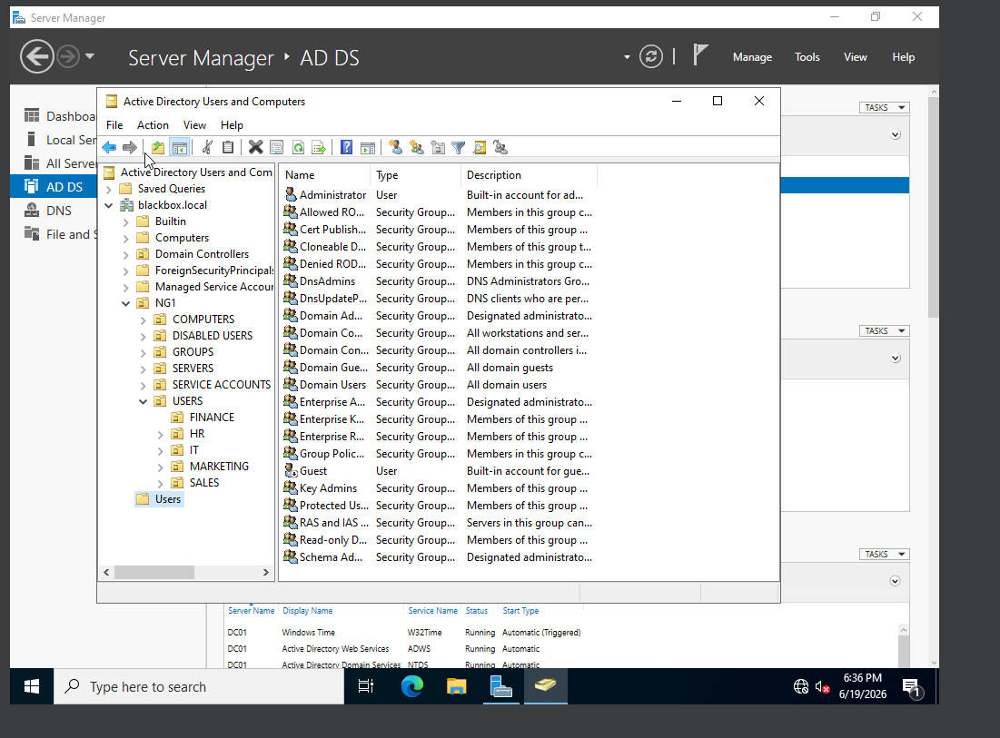
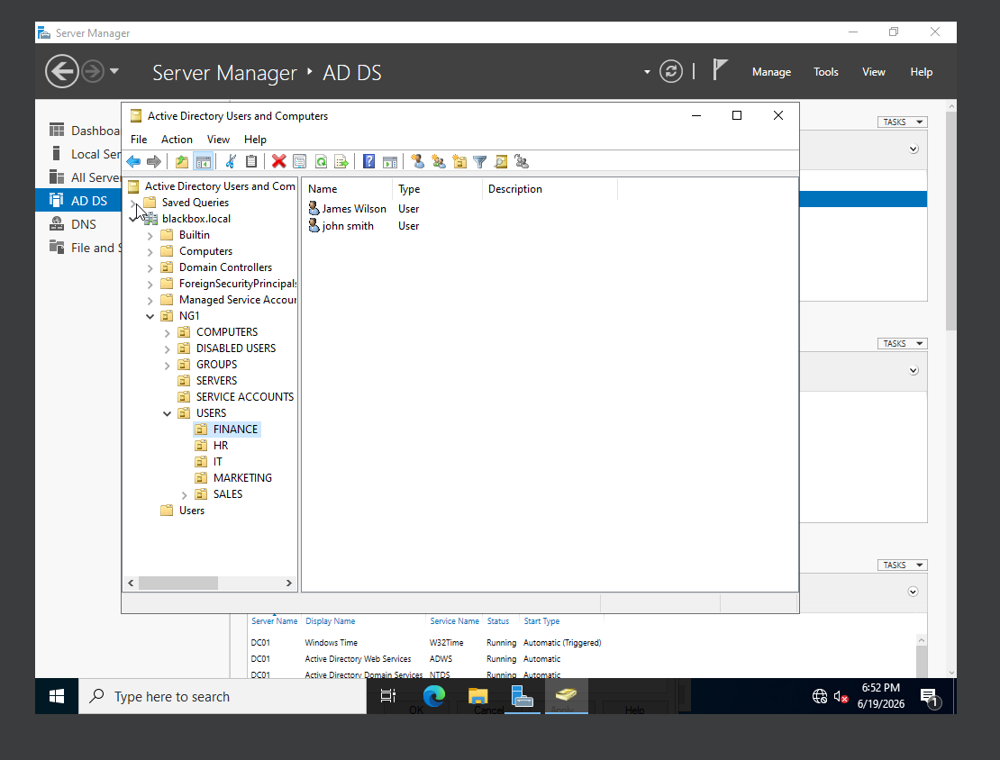
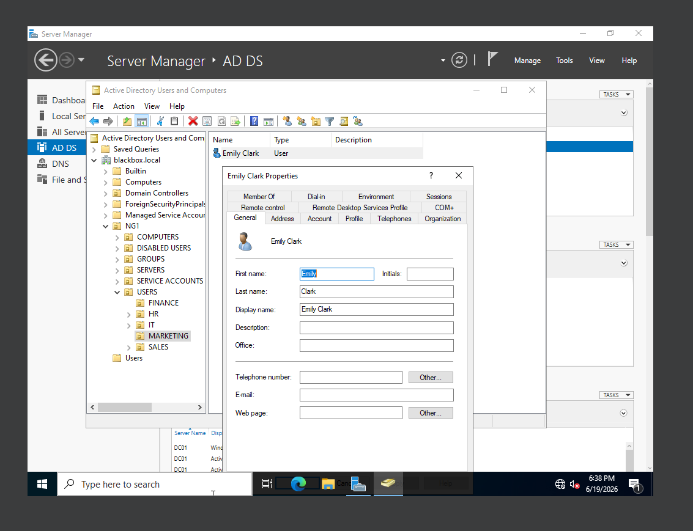
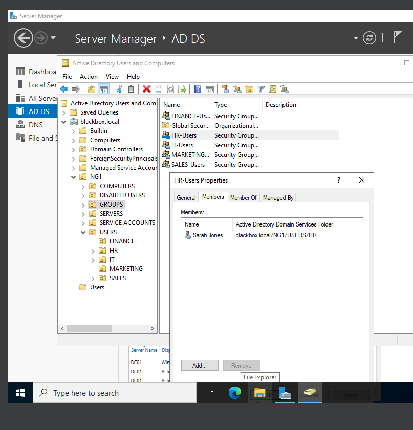
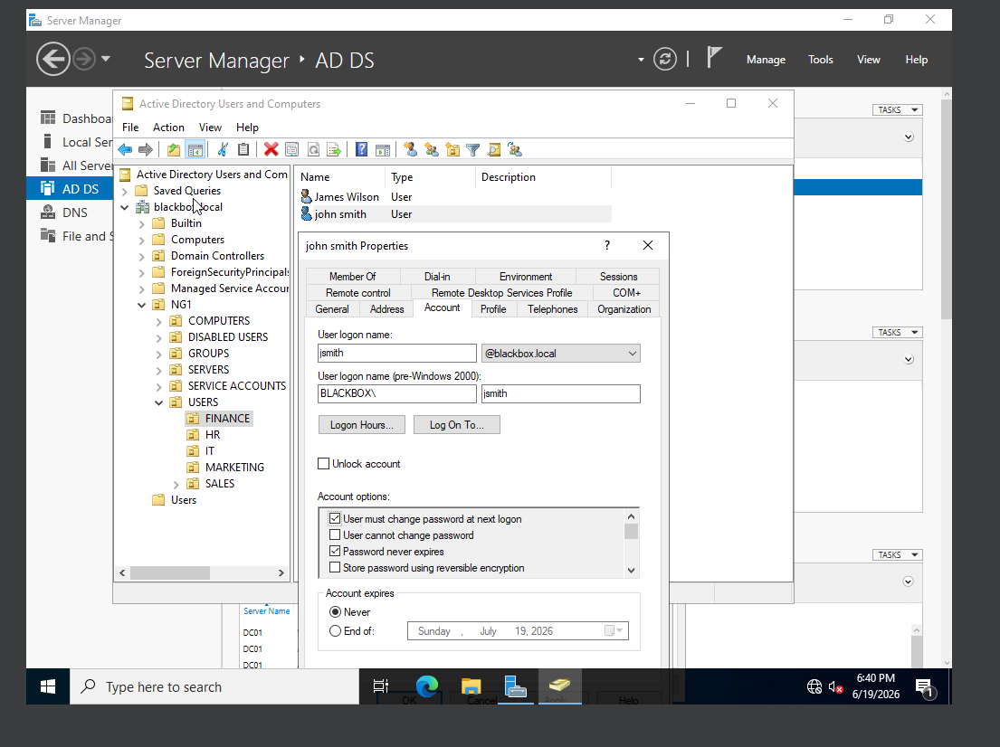
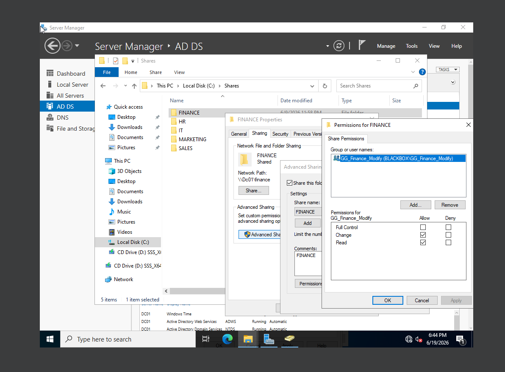

# Active Directory Help Desk Administration Lab

## Overview

This project simulates common Active Directory help desk and junior system administration tasks in a Windows Server environment. The lab focuses on Active Directory Domain Services, DNS, organizational unit structure, user account creation, group membership, password/account management, and shared folder configuration.

The goal of this lab was to practice account and access management tasks commonly seen in help desk and entry-level IT support roles.

## Lab Environment

- Windows Server
- Active Directory Domain Services
- DNS
- Active Directory Users and Computers
- Department-based organizational units
- Domain user accounts
- Security groups
- Shared folders

## Key Tasks Completed

- Installed and configured Active Directory Domain Services
- Promoted Windows Server to a domain controller
- Configured DNS role services
- Created a structured OU layout
- Created department-based user accounts
- Created and managed security groups
- Added users to appropriate groups
- Practiced password and account management options
- Created department-based shared folders
- Configured network sharing for departmental folders
- Documented the lab setup with validation screenshots

## Active Directory Structure

The domain was organized using a structured OU layout:

| OU / Container | Purpose |
|---|---|
| COMPUTERS | Workstation organization |
| DISABLED USERS | Disabled/deactivated account storage |
| GROUPS | Security group management |
| SERVERS | Server organization |
| SERVICE ACCOUNTS | Service account organization |
| USERS | Department-based user organization |

Department user OUs included:

| Department |
|---|
| Finance |
| HR |
| IT |
| Marketing |
| Sales |

## Validation Screenshots

### Domain Controller

### Organizational Unit Structure

### Active Directory Users

### User Account Creation

### Group Membership

### Password Reset / Account Management

### Shared Folder Configuration

## Limitations / Next Steps

This version of the lab focuses on server-side Active Directory administration. A future expansion of the lab will include a separate Windows client joined to the domain for testing domain logins, mapped drives, and end-user access validation.

## Skills Demonstrated

- Active Directory Domain Services setup
- Domain controller configuration
- DNS role verification
- Organizational Unit management
- User account creation
- Security group management
- Password and account-management workflow
- Department-based folder sharing
- Help desk-style account and access administration
- Technical documentation using screenshots and configuration notes
